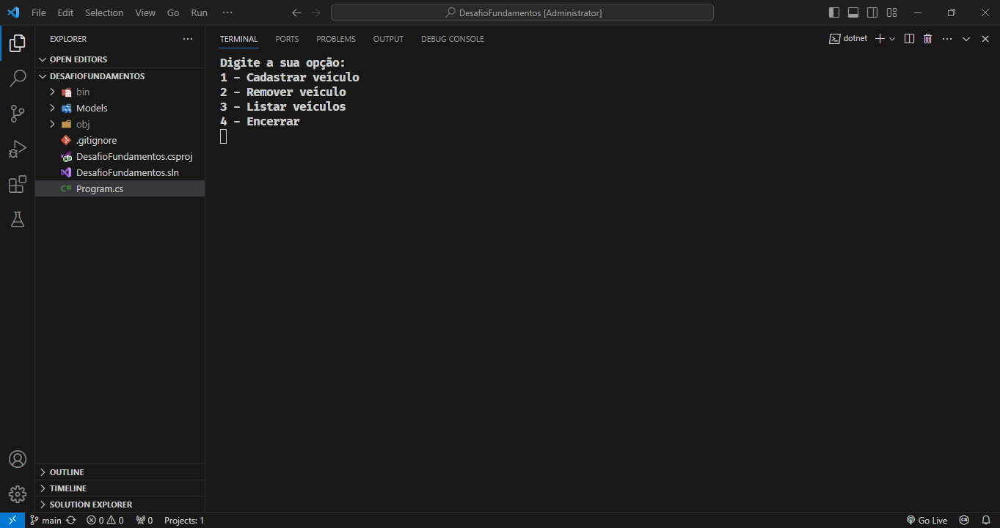

<h1 align="center"> Sistema de Gerenciamento de Estacionamento em C# - Console </h1>

Estudando tecnologias Backend com C#.  

  <a href="#-tecnologias">Tecnologias</a>&nbsp;&nbsp;&nbsp;|&nbsp;&nbsp;&nbsp;
  <a href="#-projeto">Projeto</a>&nbsp;&nbsp;&nbsp;|&nbsp;&nbsp;&nbsp;
  <a href="#-layout">Layout</a>&nbsp;&nbsp;&nbsp;|&nbsp;&nbsp;&nbsp;
  <a href="#memo-licença">Licença</a>

  

 

  

 

## 🚀 Tecnologias

Esse projeto foi desenvolvido com as seguintes tecnologias:

- Console
- Fundamentos de C#
- Git e Github

## 💻 Projeto

O sistema de gerenciamento de estacionamento é um projeto de desafio da DIO.me de fundamento C# a qual o usuario digita os valores, placa do veiculo e realiza um crud via console dos veiculos usando array, List.

<!--
- [Acesse o projeto finalizado, online](https://#)

- [Assistir aulas](https://#)

## 🔖 Layout

 Você pode visualizar o layout do projeto através [DESSE LINK](https://#). É necessário ter conta no [Figma](https://figma.com) para acessá-lo.

## :memo: Licença
-->
